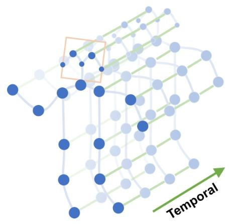

# 基于骨骼的动作识别的时空图卷积网络
作者：Sijie Yan, Yuanjun Xiong, Dahua Lin
香港中文大学信息工程系
{ys016, dhlin}@ie.cuhk.edu.hk, bitxiong@gmail.com

## 摘要
人体骨骼的动态信息在人类动作识别中具有重要意义。传统的骨骼建模方法通常依赖手工制作的部件或遍历规则，这导致表达能力有限，泛化能力也较差。在这项工作中，我们提出了一种名为时空图卷积网络（ST-GCN）的动态骨骼模型，它通过从数据中自动学习空间和时间模式，克服了以往方法的局限性。这种方法不仅具有更强的表达能力，而且泛化能力也更强。在两个大型数据集Kinetics和NTU-RGBD上，该模型相比主流方法有显著的性能提升。

## 1. 引言
近年来，人类动作识别成为了视频理解领域的一个活跃研究方向，它在视频理解中发挥着重要作用。一般来说，人类动作可以通过多种模态进行识别（Simonyan和Zisserman，2014；Tran等人，2015；Wang、Qiao和Tang，2015；Wang等人，2016；Zhao等人，2017），如外观、深度、光流和人体骨骼（Du、Wang和Wang，2015；Liu等人，2016）。在这些模态中，动态人体骨骼通常能传达与其他模态互补的重要信息。然而，与外观和光流相比，动态骨骼的建模受到的关注相对较少。在这项工作中，我们系统地研究了这一模态，旨在开发一种有原则且有效的方法来对动态骨骼进行建模，并将其用于动作识别。

动态骨骼模态可以自然地用人类关节位置的时间序列来表示，形式为二维或三维坐标。然后可以通过分析这些运动模式来识别人类动作。早期利用骨骼进行动作识别的方法，只是简单地使用各个时间步的关节坐标来形成特征向量，并在其上进行时间分析（Wang等人，2012；Fernando等人，2015）。这些方法的能力有限，因为它们没有明确利用关节之间的空间关系，而这对于理解人类动作至关重要。最近，一些新方法试图利用关节之间的自然连接（Shahroudy等人，2016；Du、Wang和Wang，2015）。这些方法取得了令人鼓舞的进展，这表明了连接性的重要性。然而，大多数现有方法依赖手工制作的部件或规则来分析空间模式。因此，为特定应用设计的模型很难推广到其他场景。

图1：本文中使用的骨骼序列的时空图，所提出的ST-GCN在其上运行。蓝色点表示人体关节。人体关节之间的体内边是根据人体的自然连接定义的。帧间边连接连续帧中的相同关节。关节坐标作为ST-GCN的输入

为了克服这些限制，我们需要一种新的方法，能够自动捕捉关节空间配置中嵌入的模式以及它们的时间动态。这正是深度神经网络的优势所在。然而，如前所述，骨骼是以图的形式存在，而不是二维或三维网格，这使得像卷积网络这样已被验证有效的模型难以应用。最近，图神经网络（GCNs）将卷积神经网络（CNNs）推广到任意结构的图上，受到了越来越多的关注，并成功应用于许多领域，如图像分类（Bruna等人，2014）、文档分类（Defferrard、Bresson和Vandergheynst，2016）以及半监督学习（Kipf和Welling，2017）。然而，这方面的许多前期工作都假设输入是固定的图。将GCNs应用于大规模数据集上的动态图建模，如人体骨骼序列，仍有待探索。

在本文中，我们提出通过将图神经网络扩展为时空图模型，来设计一种用于动作识别的骨骼序列通用表示，即时空图卷积网络（ST-GCN）。如图1所示，该模型构建在一系列骨骼图之上，其中每个节点对应人体的一个关节。有两种类型的边：一种是符合关节自然连接的空间边，另一种是连接连续时间步中相同关节的时间边。在此基础上构建了多层时空图卷积，使得信息能够在空间和时间维度上进行整合。

ST-GCN的层次结构特性消除了对手工部件分配或遍历规则的需求。这不仅提高了模型的表达能力，从而获得更高的性能（如我们的实验所示），而且使其易于推广到不同的场景。在通用的GCN框架基础上，我们还从图像模型中获取灵感，研究设计图卷积核的新策略。

这项工作的主要贡献体现在三个方面：1）我们提出了ST-GCN，这是一种基于图的通用动态骨骼建模方法，首次将基于图的神经网络应用于该任务。2）我们提出了设计ST-GCN卷积核的几个原则，以满足骨骼建模的特定需求。3）在两个大规模的基于骨骼的动作识别数据集上，与以往使用手工部件或遍历规则的方法相比，所提出的模型在手动设计方面花费更少的精力，却取得了更优异的性能。ST-GCN的代码和模型已公开。

## 2. 相关工作
### 图上的神经网络
将神经网络推广到具有图结构的数据是深度学习研究中的一个新兴课题。讨论的神经网络架构包括递归神经网络（Tai、Socher和Manning，2015；Van Oord、Kalchbrenner和Kavukcuoglu，2016）和卷积神经网络（CNNs）（Bruna等人，2014；Henaff、Bruna和LeCun，2015；Duvenaud等人，2015；Li等人，2016；Defferrard、Bresson和Vandergheynst，2016）。这项工作与CNNs的推广，即图卷积网络（GCNs）更为相关。在图上构建GCNs的原理通常遵循两个方向：1）谱视角，通过谱分析的形式考虑图卷积的局部性（Henaff、Bruna和LeCun，2015；Duvenaud等人，2015；Li等人，2016；Kipf和Welling，2017）；2）空间视角，将卷积滤波器直接应用于图节点及其邻居（Bruna等人，2014；Niepert、Ahmed和Kutzkov，2016）。这项工作遵循第二种方向的思路。我们在空间域中构建CNN滤波器，将每个滤波器的应用限制在每个节点的1 - 邻域内。

### 基于骨骼的动作识别
人体的骨骼和关节轨迹对光照变化和场景变化具有鲁棒性，并且由于高精度的深度传感器或姿态估计算法（Shotton等人，2011；Cao等人，2017a），它们很容易获取。因此，基于骨骼的动作识别方法有很多。这些方法可以分为基于手工特征的方法和深度学习方法。第一种方法设计了一些手工特征来捕捉关节运动的动态。这些特征可以是关节轨迹的协方差矩阵（Hussein等人，2013）、关节的相对位置（Wang等人，2012），或者身体部位之间的旋转和平移（Vemulapalli、Arrate和Chellappa，2014）。深度学习的兴起导致了基于深度学习的骨骼建模方法的涌现。这些工作使用递归神经网络（Shahroudy等人，2016；Zhu等人，2016；Liu等人，2016；Zhang、Liu和Xiao，2017）和时间CNNs（Li等人，2017；Ke等人，2017；Kim和Reiter，2017）以端到端的方式学习动作识别模型。在这些方法中，许多都强调了对人体部分内的关节进行建模的重要性。但是这些部分通常是使用领域知识明确分配的。我们的ST-GCN是首次将图CNNs应用于基于骨骼的动作识别任务。它与以往方法的不同之处在于，它可以通过利用图卷积的局部性以及时间动态来隐式地学习部分信息。通过消除手动部件分配的需求，该模型更易于设计，并且能够学习更好的动作表示。

## 3. 时空图卷积网络
在进行活动时，人体关节以小的局部群组形式运动，这些群组被称为“身体部位”。现有的基于骨骼的动作识别方法已经验证了在建模中引入身体部位的有效性（Shahroudy等人，2016；Liu等人，2016；Zhang、Liu和Xiao，2017）。我们认为这种改进主要是因为与整个骨骼相比，身体部位将关节轨迹的建模限制在“局部区域”内，从而形成了骨骼序列的层次化表示。在图像物体识别等任务中，层次化表示和局部性通常是由卷积神经网络的固有属性实现的（Krizhevsky、Sutskever和Hinton，2012），而不是手动分配物体部件。这启发我们将CNNs的这种吸引人的属性引入到基于骨骼的动作识别中。这次尝试的结果就是ST-GCN模型。

### 3.1 流程概述
基于骨骼的数据可以从运动捕捉设备获取，或者通过视频的姿态估计算法得到。通常数据是一系列帧，每一帧都有一组关节坐标。给定以二维或三维坐标形式表示的人体关节序列，我们以关节为图节点，以人体结构和时间上的自然连接为图边，构建一个时空图。因此，ST-GCN的输入是图节点上的关节坐标向量。这可以类比为基于图像的CNNs，其输入是由二维图像网格上的像素强度向量组成。对输入数据应用多层时空图卷积操作，在图上生成更高层次的特征图。然后通过标准的Softmax分类器将其分类到相应的动作类别。整个模型通过反向传播进行端到端的训练。现在我们来介绍ST-GCN模型的各个组件。

### 3.2 骨骼图构建
一个骨骼序列通常由每一帧中每个人体关节的二维或三维坐标表示。以往使用卷积进行骨骼动作识别的工作（Kim和Reiter，2017）将所有关节的坐标向量连接起来，形成每帧的单个特征向量。在我们的工作中，我们利用时空图来形成骨骼序列的层次化表示。具体来说，我们在具有N个关节和T帧的骨骼序列上构建一个无向时空图$G=(V, E)$，该图同时具有体内连接和帧间连接。

在这个图中，节点集$V = \{v_{ti} | t = 1, ..., T, i = 1, ..., N\}$包含了骨骼序列中的所有关节。作为ST-GCN的输入，节点$F(v_{ti})$上的特征向量由第t帧上第i个关节的坐标向量以及估计置信度组成。我们分两步在骨骼序列上构建时空图。首先，根据人体结构的连接性，连接同一帧内的关节，如图1所示。然后，每个关节将与连续帧中的相同关节相连。这样的连接是自然定义的，无需手动分配部件。这也使得网络架构能够在具有不同关节数量或关节连接性的数据集上工作。例如，在Kinetics数据集上，我们使用OpenPose（Cao等人，2017b）工具箱的二维姿态估计结果，该工具箱输出18个关节；而在NTURGB + D数据集（Shahroudy等人，2016）上，我们使用三维关节跟踪结果作为输入，产生25个关节。STGCN在这两种情况下都能运行，并提供一致的优异性能。构建的时空图的一个示例如图1所示。

形式上，边集E由两个子集组成，第一个子集描述了每一帧内的骨骼内连接，表示为$E_{S} = \{v_{ti}v_{tj} | (i, j) \in H\}$，其中H是人体自然连接关节的集合。第二个子集包含帧间边，这些边连接连续帧中的相同关节，即$E_{F} = \{v_{ti}v_{(t + 1)i}\}$。因此，对于一个特定的关节i，$E_{F}$中的所有边将表示其随时间的轨迹。

### 3.3 空间图卷积神经网络
在深入研究完整的ST-GCN之前，我们先来看单帧内的图CNN模型。在这种情况下，在时间T的单帧上，将有N个关节节点$V_{t}$，以及骨骼边$E_{S}(\tau) = \{v_{ti}v_{tj} | t = \tau, (i, j) \in H\}$。回顾在二维自然图像或特征图上的卷积操作定义，它们都可以看作是二维网格。卷积操作的输出特征图又是一个二维网格。在步长为1且适当填充的情况下，输出特征图可以与输入特征图具有相同的大小。在下面的讨论中，我们将假设这个条件。给定一个核大小为$K × K$的卷积算子，以及一个具有c个通道的输入特征图$f_{in}$。在空间位置x处的单个通道的输出值可以写为：
$$f_{out }(x)=\sum_{h=1}^{K} \sum_{w=1}^{K} f_{in }(p(x, h, w)) \cdot w(h, w), (1)$$
其中采样函数$p: Z^{2} ×Z^{2} \to Z^{2}$枚举位置x的邻居。在图像卷积的情况下，它也可以表示为$p(x, h, w)=x + p'(h, w)$。权重函数$w: Z^{2} \to \mathbb{R}^{c}$在c维实空间中提供一个权重向量，用于与采样得到的c维输入特征向量计算内积。注意，权重函数与输入位置x无关。因此，滤波器权重在输入图像上处处共享。因此，通过在$p(x)$中编码一个矩形网格，实现了图像域上的标准卷积。关于这个公式的更详细解释和其他应用可以在（Dai等人，2017）中找到。

然后，通过将上述公式扩展到输入特征图位于空间图$V_{t}$上的情况，来定义图上的卷积操作。即，特征图$f_{in }^{t}: V_{t} \to R^{c}$在图的每个节点上都有一个向量。扩展的下一步是重新定义采样函数P和权重函数w。
 - **采样函数**：在图像上，采样函数$p(h, w)$是在相对于中心位置x的相邻像素上定义的。在图上，我们可以类似地在节点$v_{ti}$的邻居集$B(v_{ti}) = \{v_{tj} | d(v_{tj}, v_{ti}) ≤ D\}$上定义采样函数。这里$d(v_{tj}, v_{ti})$表示从$v_{tj}$到$v_{ti}$的任何路径的最小长度。因此，采样函数$p: B(v_{ti}) \to V$可以写为：
 $$p\left(v_{t i}, v_{t j}\right)=v_{t j} . (2)$$
 在这项工作中，我们在所有情况下都使用$D = 1$，即关节节点的1 - 邻域集。更高的D值留待未来研究。
 - **权重函数**：与采样函数相比，权重函数的定义更具挑战性。在二维卷积中，中心位置周围自然存在一个刚性网格。因此，邻居内的像素可以有固定的空间顺序。权重函数可以通过根据空间顺序索引一个$(c, K, K)$维的张量来实现。对于像我们刚刚构建的这样的一般图，不存在这样的隐式排列。（Niepert、Ahmed和Kutzkov，2016）中首次研究了这个问题的解决方案，其中通过在根节点周围的邻居图中的图标记过程来定义顺序。我们遵循这个思路来构建我们的权重函数。与给每个邻居节点一个唯一标记不同，我们通过将关节节点$v_{ti}$的邻居集$B(v_{ti})$划分为固定数量的K个子集来简化这个过程，每个子集都有一个数字标记。因此，我们可以有一个映射$l_{ti}: B(v_{ti}) \to \{0, ..., K - 1\}$，将邻域中的一个节点映射到它的子集标记。权重函数$v(v_{ti}, v_{tj}): B(v_{ti}) \to R^{c}$可以通过索引一个$(c, K)$维的张量来实现，或者：
 $$w\left(v_{t i}, v_{t j}\right)=w'\left(l_{t i}\left(v_{t j}\right)\right) .$$
 有了改进的采样函数和权重函数，我们现在用图卷积的形式重写公式（1）为：
 $$f_{out }\left(v_{t i}\right)=\sum_{v_{t j} \in B\left(v_{t i}\right)} \frac{1}{Z_{t i}\left(v_{t j}\right)} f_{in }\left(p\left(v_{t i}, v_{t j}\right)\right) \cdot w\left(v_{t i}, v_{t j}\right),$$
 其中归一化项$Z_{ti}(v_{tj}) = |\{v_{tk} | l_{ti}(v_{tk}) = l_{ti}(v_{